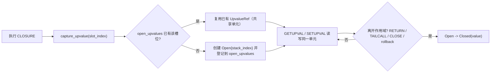

# Lua VM Open Upvalue 学习笔记（两步法）

这份笔记固定你刚完成的两步学习内容：
1. 闭包 upvalue 机制总览（对象关系 + 状态变化 + 测试映射）
2. `upvalue_survives_after_outer_return` 的逐指令执行追踪

---

## 第一步：先看“整体机制图”



### 1.1 关键对象（你要牢牢记住）
- `stack[idx]`：真实变量值所在的槽位（函数运行时）
- `open_upvalues: BTreeMap<usize, UpvalueRef>`：把“槽位索引 -> upvalue 单元”建立唯一映射
- `UpvalueCell`：
  - `Open { stack_index }`：读写直达栈槽位
  - `Closed(Value)`：作用域结束后封箱保存

代码位置：
- `src/vm/model.rs`
- `src/vm/upvalue.rs`

### 1.2 指令层对应关系
- `CLOSURE`：决定“捕获新建 or 复用共享单元”
- `GETUPVAL`：读 upvalue（Open 读栈，Closed 读封箱值）
- `SETUPVAL`：写 upvalue（Open 写栈，Closed 改封箱值）
- `CLOSE A`：封闭当前帧 `R[A]` 及以上关联 upvalue

代码位置：
- `src/opcode.rs`
- `src/vm/execute.rs`

### 1.3 生命周期边界（重点）
- `RETURN` 前封闭当前帧 upvalue
- `TAILCALL` 替换帧前封闭当前帧 upvalue
- `pcall rollback` 回退前封闭将失效槽位上的 upvalue

代码位置：
- `src/vm/execute.rs`
- `src/vm/call.rs`
- `src/vm/frame.rs`

### 1.4 五个测试和语义点映射
- `closure_shared_cell_between_two_closures`：
  - 验证多个闭包捕获同一局部变量时共享同一单元
- `upvalue_survives_after_outer_return`：
  - 验证外层返回后 upvalue 被封闭但仍可读写
- `nested_upvalue_forwarding_mutable`：
  - 验证 `instack=false` 链式转发依然共享同一单元
- `close_instruction_closes_scope_boundary`：
  - 验证 `CLOSE A` 只影响边界及以上 upvalue
- `pcall_rollback_with_open_upvalue`：
  - 验证异常回滚后无悬挂 open upvalue

测试文件：
- `tests/vm_call.rs`

---

## 第二步：逐指令追踪 `upvalue_survives_after_outer_return`

目标测试：
- `tests/vm_call.rs` 中 `upvalue_survives_after_outer_return`

Lua 对照语义：
```lua
local function outer()
  local x = 1
  local function get() return x end
  local function set(v) x = v end
  return get, set
end

local get, set = outer()
set(99)
return get()
```

### 2.1 执行轨迹表

| 步骤 | 当前帧 | 指令/动作 | 关键状态变化 |
|---|---|---|---|
| 1 | `main` | `R0 = outer` | 把 `outer` 函数对象放到 `R0` |
| 2 | `main` | `call R0, B=1, C=0` | 进入 `outer()`，主调希望多返回 |
| 3 | `outer` | `R0 = 1` | 局部变量 `x` 在 `outer.R0` |
| 4 | `outer` | `R1 = closure(get)` | `get` 捕获 `x`，生成 upvalue `U=Open{outer.R0}` |
| 5 | `outer` | `R2 = closure(set)` | `set` 复用同一个 `U`（共享） |
| 6 | `outer` | `return R1,R2` | 返回前封闭：`U` 变成 `Closed(1)` |
| 7 | `main` | 接收返回 | `R0=get`, `R1=set` |
| 8 | `main` | `R2 = 99` | 准备调用参数 |
| 9 | `main` | `call R1, B=2, C=1` | 调用 `set(99)` |
| 10 | `set` | `SETUPVAL R0 -> upvalue[0]` | `U` 从 `Closed(1)` 更新为 `Closed(99)` |
| 11 | `set` | `return` | 回到 `main` |
| 12 | `main` | `call R0, B=1, C=2` | 调用 `get()` |
| 13 | `get` | `GETUPVAL upvalue[0] -> R0` | 读取 `Closed(99)` |
| 14 | `main` | `return R0` | 最终返回 `99` |

### 2.2 你该得到的学习结论
- 闭包不是“复制变量”，而是持有“变量单元引用”
- `Open -> Closed` 转换发生在“离开作用域边界”时
- `get/set` 能互相观察到修改，是因为共享同一个 upvalue 单元
- 这正是“静态作用域在运行时”的核心机制

---

## 复习建议（最短路径）
1. 先只看 `src/vm/upvalue.rs` 的 5 个函数，画出 Open/Closed 转换时机。
2. 再按测试顺序跑：共享 -> 外层返回后生存 -> 链式转发 -> CLOSE 边界 -> rollback 安全。
3. 最后回到 `src/vm/execute.rs`，对照每条相关指令理解“语义落地代码”。
